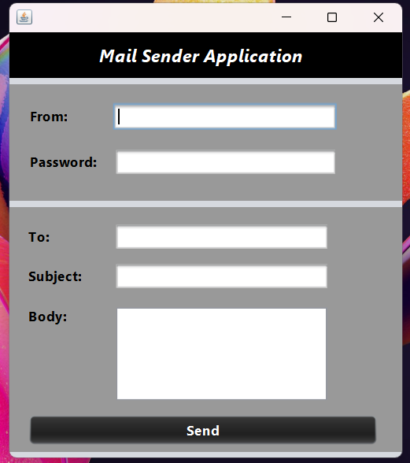
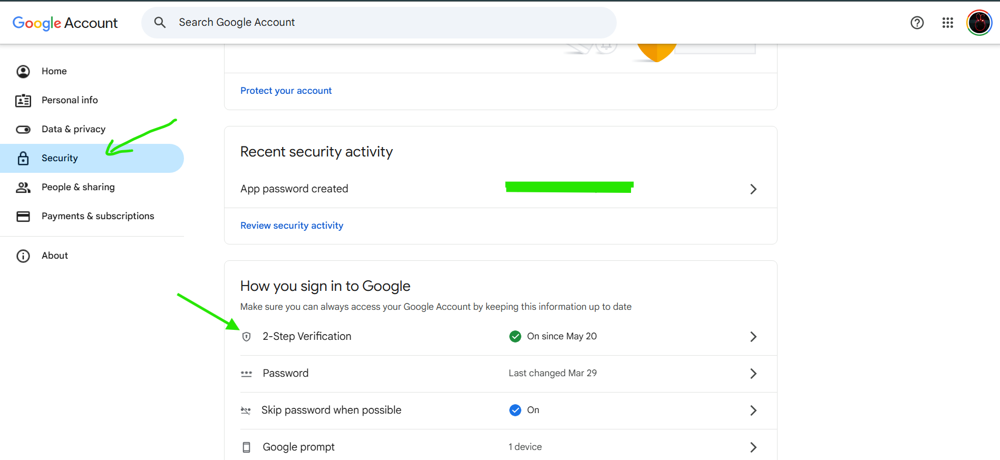

# 📧 Simple Mail Sender Application

A user-friendly, Java-based **Graphical User Interface (GUI)** application designed to allow users to quickly and easily send emails directly from their Windows desktop.

---

## ✨ Project Overview

This project provides a straightforward way for Windows users to send emails without needing to open a web browser or a full-featured email client. The application is packaged as a standard **Windows executable (`.exe`) file**, making it easy to download, install, and run.

* Product Image
  

### **Who is it for?**

* **Casual Users** who need a simple, no-fuss tool to send occasional emails.
* **Developers/Testers** who require a quick utility for testing email-sending functionality or alerts.
* **Anyone** running a Windows operating system who prefers a dedicated, lightweight desktop application for email sending.

---

## 🛠️ Key Features

* **Intuitive GUI:** Built for simplicity and ease of use.
* **Windows Native:** Packaged as a standard Windows executable (`.exe`).
* **Secure Authentication:** Utilizes **Google App Passwords** for secure access to the sender's Gmail account, adhering to modern security standards (two-factor authentication required for setup).

---

## 🚀 Technologies Used

The application utilizes a robust combination of tools for development, design, and packaging:

| Category | Tool | Purpose |
| :--- | :--- | :--- |
| **Development & Design** | **Java** | Core programming language. |
| **IDE & GUI Builder** | **Apache NetBeans** | For design, development, and project management. |
| **Email Service Provider** | **Google (Gmail)** | The service through which emails are sent. |
| **Secure Authentication** | **Google App Passwords** | Used instead of the primary account password for enhanced security. |
| **Executable Packaging** | **launch4j** | To wrap the Java application (`.jar`) into a native Windows executable (`.exe`). |
| **Installer Creation** | **Inno Setup** | To create a professional Windows installer package. |

---

## ⚙️ Setup and Usage

### **Prerequisites: Google App Password**

Before using the application, the sender's Google account **must** have a **Google App Password** generated. This password is required to log in and send emails through the application, as direct use of the main account password is not supported for security reasons.

1.  Enable **2-Step Verification** on your Google Account.
2.  Generate a new **App Password** for this application (e.g., choose "Mail" and "Windows Computer" for the app and device).
3.  Use the generated App Password, **not** your regular Google password, in the application's login fields.
### **App Password Generation Steps**
1.  Go to your Google Account settings.
2.  Navigate to the **Security** section.
  
3.  Under **"Signing in to Google,"** select **App Passwords**.
  

4.  You may need to sign in again for security purposes.
5. Enter App Name for which you want to generate the password.
6.  Click **Generate** to create the App Password.
  
7.  Copy the generated password and use it in the Mail Sender application
  
8. **Don't forget to SAVE password cause it will be only one time shown**.
 

### **Installation**

1.  Download the **installer file** (created with Inno Setup) from the release page.
2.  Run the installer and follow the on-screen prompts to install the application on your Windows machine.
3.  Launch the application from the Start Menu or desktop shortcut.

### **Sending a Mail**

1.  Enter your **Sender Email Address** (must be a Gmail account).
2.  Enter the **App Password** you generated in the prerequisites step.
3.  Fill in the **Recipient's Email Address**, **Subject**, and **Body** of the email.
4.  Click the **Send** button.

---
### **Download apps**
- Netbeans Download Link:
https://netbeans.apache.org/front/main/download/nb24/
- Inno Setup link
https://jrsoftware.org/download.php/is.exe?site=1
- launch4j
https://sourceforge.net/projects/launch4j/files/latest/download
- Libraries
https://drive.google.com/drive/folders/1fIduDdQR-4tQ95dkMrr9pORLc30z04Mq?usp=sharing
## 🤝 Contributing

This project is currently maintained by **[KumudKode]**. If you have suggestions or encounter issues, please open an issue in the repository.
